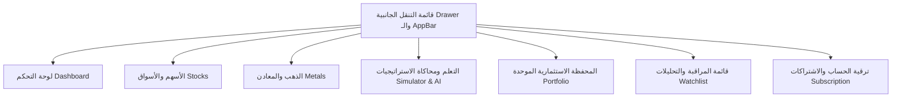

# 🎯 الخطة الشاملة لدمج واجهات البرمجة (APIs) وتحسين شاشات تطبيق مساعد الاستثمار

تهدف هذه الخطة إلى جعل تطبيق مساعد الاستثمار (Flutter) مرآة كاملة للموقع الرسمي (باستثناء لوحات تحكم المسؤولين Admin). تضمن الخطة استخدام وتفعيل كافة الإمكانيات المتاحة والجديدة لتقديم تجربة مستخدم سريعة، متميزة، وذات تصميم عصري واحترافي.

---

## 📌 1. البنية البرمجية وربط واجهات الـ API المتاحة والجديدة

تتوزع واجهات الـ API الموثقة في [API_HANDBOOK.md](file:///d:/My%20WebStie%20Applications/Flutter/investment/documents/API_HANDBOOK.md) على النحو التالي في الكود المشترك لعميل الـ API الموحد [client.dart](file:///d:/My%20WebStie%20Applications/Flutter/investment/lib/api/client.dart):

### أ. إدارة وتفضيلات الأسواق المتعددة (EGX, TADAWUL, KSE, QSE, DFM, ADX, BSE)
- **الهدف**: تمكين المستخدم من التبديل الفوري بين الأسواق العربية والمصرية من الشريط العلوي للتطبيق، وتكييف كافة البيانات المعروضة في الشاشات بناءً على هذا التفضيل.
- **مسارات الـ API المدمجة**:
  - `GET /api/market/overview?market={code}` -> يتم استدعاؤه عبر `getMarketOverview(market)` لجلب ملخص السوق، الحالة (مفتوح/مغلق)، وأكثر الأسهم ارتفاعاً وانخفاضاً.
  - `GET /api/market/live-data?market={code}` -> يتم استدعاؤه عبر `getMarketLiveData(market)` لجلب حركة الأسعار الفورية.
  - `GET /api/market/investing?market={code}` -> يتم استدعاؤه عبر `getMarketInvesting(market)` لجلب إحصائيات الاستثمار والسيولة.
  - `GET /api/v2/unified/markets` -> يتم استدعاؤه عبر `getUnifiedMarkets()` لمعرفة الأسواق النشطة وإعداداتها.

### ب. شاشة الذهب والمعادن (Metals Screen)
- **الهدف**: تزويد التطبيق بشاشة لعرض أسعار الذهب الفورية للجرامات (عيار 24، 22، 21، 18) والأوقية محلياً وعالمياً، مع حاسبة للوزن ورسم بياني تاريخي.
- **مسارات الـ API المدمجة**:
  - `GET /api/mobile/gold` (بديل تراجعي لـ `/api/metals/gold`) -> يتم استدعاؤه عبر `getGold()` لجلب قائمة الأسعار الفورية لعيارات الذهب والفضة.
  - `GET /api/mobile/gold/history?karat={karat}&days={days}` (بديل تراجعي لـ `/api/metals/gold/history`) -> يتم استدعاؤه عبر `getGoldHistory(karat, days)` لعرض مسار الأسعار التاريخية على الرسم البياني التفاعلي.

### ج. مركز اختبار الاستراتيجيات والمحاكاة (Backtesting & Walk-Forward)
- **الهدف**: منح المستخدم القدرة على اختبار استراتيجيات التداول الفنية على البيانات التاريخية للأسهم.
- **مسارات الـ API المدمجة**:
  - `POST /api/backtest` -> استدعاء `runBacktest(strategy, ticker, startDate, endDate)` لتشغيل اختبار مخصص لاستراتيجية معينة على سهم محدد.
  - `GET /api/backtesting` -> استدعاء `getBacktestingResults()` لجلب نتائج الاختبارات الجاهزة.
  - `POST /api/backtesting/unified` -> استدعاء `runUnifiedBacktest(data)` لتشغيل اختبارات متقدمة متعددة الأصول.
  - `GET /api/walk-forward/run` -> استدعاء `runWalkForward()` لتشغيل الفحص التقديمي المتقدم.

### د. مركز التعلم والذكاء الذاتي للـ AI (Learning & AI Self-Learning)
- **الهدف**: عرض نتائج قرارات الذكاء الاصطناعي ونسب نجاح المؤشرات الفنية والنماذج السعرية المكتشفة.
- **مسارات الـ API المدمجة**:
  - `GET /api/unified-learning/indicators` -> استدعاء `getUnifiedLearningIndicators()` لمعرفة نسب ثقة محرك الذكاء الاصطناعي في المؤشرات الفنية المختلفة (RSI, MACD, Volume) لكل سهم.
  - `GET /api/unified-learning/patterns` -> استدعاء `getUnifiedLearningPatterns()` لعرض النماذج الفنية المكتشفة كالقاع المزدوج والقمم.
  - `GET /api/unified-learning/status` -> استدعاء `getUnifiedLearningStatus()` لمعرفة تقدم التدريب الذاتي للـ AI.
  - `POST /api/unified-learning/mine-lessons` -> استدعاء `mineUnifiedLearningLessons()` لاستخراج الأنماط والدروس المستفادة.

### هـ. الاشتراكات والتحقق من بوابات الدفع (Subscriptions & Payments)
- **الهدف**: توفير واجهة دفع آمنة ومتكاملة لحسابات الترقية (الباقة الفضية والذهبية والماسية) والتحقق من العمليات لحماية المحتوى المتميز.
- **مسارات الـ API المدمجة**:
  - `POST /api/paymob/create-payment` -> استدعاء `createPaymobPayment(amount, currency, planId)` لإنشاء فاتورة PayMob وعرض صفحة الدفع الآمنة عبر WebView مدمج.
  - `POST /api/instapay/verify` -> استدعاء `verifyInstapayPayment(txHashOrDetails)` لإرسال المعرف الخاص بالمعاملة للمراجعة والتحقق الفوري.
  - `POST /api/google-play/verify-receipt` -> استدعاء `verifyGooglePlayReceipt(receiptData)` لتأكيد عمليات الشراء والاشتراكات المباشرة من داخل التطبيق.
  - `POST /api/subscription/check-access` -> استدعاء `checkSubscriptionAccess(feature)` للتحقق من صلاحيات تشغيل الميزات المحددة (Feature Gating).

### و. إدارة وتوثيق الحسابات (Authentication & Missing Data Verification)
- **الهدف**: التأكد من اكتمال معلومات المستخدم عند التسجيل لأول مرة (مثل رقم الهاتف للتحقق) بعد تسجيل الدخول بحساب Google.
- **مسارات الـ API المدمجة**:
  - `POST /api/auth/google` -> تسجيل الدخول السلس.
  - `PUT /api/auth/profile` -> تحديث البيانات الناقصة (مثل رقم الهاتف) عبر `updateProfile(phone)`.

---

## 🖼️ 2. توزيع وتصميم شاشات التطبيق (Premium UI/UX Design)

تعتمد جميع الشاشات على نظام ألوان النيون الداكن المتناسق (`AppColors` الموثق في [colors.dart](file:///d:/My%20WebStie%20Applications/Flutter/investment/lib/theme/colors.dart)) لتقديم طابع مميز وجذاب:



### 1. شريط التطبيق والتنقل العلوي ([app.dart](file:///d:/My%20WebStie%20Applications/Flutter/investment/lib/app.dart))
- **منتقي الأسواق (Market Selector)**: زر ديناميكي في الـ AppBar (بشكل أيقونة علم الدولة أو رمز السوق) يتيح التغيير الفوري، مع حفظ الاختيار في `SharedPreferences` وتحديث شاشات لوحة التحكم والأسهم تلقائياً.
- **القائمة الجانبية (Drawer)**: تحتوي على روابط مباشرة وسهلة للوصول إلى الأقسام الجديدة باللغة العربية:
  - 🏠 الرئيسية ولوحة التحكم
  - 📈 الأسهم والأسواق
  - 💰 الذهب والمعادن (جديدة)
  - 🧠 محاكاة الاستراتيجيات والتعلم (جديدة)
  - ₿ العملات الرقمية
  - 📊 محفظتي الاستثمارية
  - 🔔 التنبيهات وقائمة المراقبة
  - 💎 ترقية الحساب والاشتراكات

### 2. لوحة التحكم الرئيسية ([dashboard_screen.dart](file:///d:/My%20WebStie%20Applications/Flutter/investment/lib/screens/dashboard_screen.dart))
- **التصميم**:
  - بطاقات دائرية لعرض حالة السوق الحالية وتوفر السيولة.
  - شبكة عرض سريعة (Dashboard Grid) بأيقونات نيون ملونة للوصول السريع إلى الشاشات الملحقة.
  - دمج التحليلات الفورية المفلترة بناءً على السوق المحدد نشطاً في الـ AppBar.

### 3. شاشة الذهب والمعادن ([metals_screen.dart](file:///d:/My%20WebStie%20Applications/Flutter/investment/lib/screens/metals_screen.dart))
- **التصميم**:
  - **القسم العلوي**: بطاقة نيون متوهجة لعرض سعر الأوقية عالمياً ونسبة التغير اليومي.
  - **شبكة العيارات المحلية**: بطاقات مخصصة لأسعار الجرامات محلياً (عيار 24، 22، 21، 18) مع أسعار البيع والشراء.
  - **حاسبة الذهب**: حقل إدخال الوزن مع قائمة اختيار العيار وحساب القيمة الكلية ديناميكياً وعرضها بنص متوهج كبير.
  - **مخطط الأسعار**: رسم بياني متجاوب يعرض حركة السعر التاريخية للذهب لمُدد مختلفة (7 أيام، 30 يوم، 90 يوم).

### 4. شاشة التعلم والـ Backtesting ([learning_backtest_screen.dart](file:///d:/My%20WebStie%20Applications/Flutter/investment/lib/screens/learning_backtest_screen.dart))
- **التصميم**:
  - شريط تبويبات علوي (Tabs):
    1. **محاكاة الاستراتيجيات**: يتيح تحديد الاستراتيجية (تقاطعات المتوسطات MA، RSI، إلخ)، واختيار السهم، الفترة الزمنية، ومبلغ المحاكاة، مع عرض نتائج تفصيلية (العائد السنوي، نسبة النجاح، أقصى تراجع).
    2. **ثقة المؤشرات الفنية (AI Trust)**: رسم بياني أو بطاقات تظهر مدى موثوقية كل مؤشر فني لكل سهم بناءً على تحليلات الذكاء الاصطناعي الذاتية.
    3. **الدروس المستفادة والأنماط**: استعراض النماذج المكتشفة فورياً في السوق والدروس المستخرجة من أداء الـ AI الذاتي.

### 5. شاشة المحفظة المتقدمة ([portfolio_screen.dart](file:///d:/My%20WebStie%20Applications/Flutter/investment/lib/screens/portfolio_screen.dart))
- **التصميم**:
  - فرز ثلاثي علوي: أسهم | عملات رقمية | معادن وذهب.
  - تحليلات توزيع المحفظة (Portfolio Diversification): عرض رسم بياني دائري (Pie Chart) يوضح نسب توزيع الأصول ومعدل المخاطر الكلي للمحفظة عبر الـ API `/api/portfolio/analyze`.
  - واجهة إضافة وتعديل مرنة تدعم كافة فئات الأصول.

### 6. شاشة قائمة المراقبة المتكاملة ([watchlist_screen.dart](file:///d:/My%20WebStie%20Applications/Flutter/investment/lib/screens/watchlist_screen.dart))
- **التصميم**:
  - تصنيف محلي ذكي للأصول المضافة لفرزها وعرض تفاصيل السعر اللحظي لكل أصل.
  - أيقونة التنبيه السريع لتحديد مستويات الأسعار المستهدفة (أكبر من / أصغر من) واستقبال إشعارات محلية فور تخطي السعر للحد المطلوب.

### 7. شاشة الترقية وبوابات الدفع ([subscription_screen.dart](file:///d:/My%20WebStie%20Applications/Flutter/investment/lib/screens/subscription_screen.dart))
- **التصميم**:
  - عرض الباقات المتاحة (الفضية، الذهبية، الماسية) بأسلوب مقارنة متميز.
  - عند الضغط على ترقية، يظهر لوح سفلي تفاعلي (Payment Bottom Sheet) يتيح الاختيار بين:
    - **بطاقة الائتمان / المحفظة الإلكترونية (PayMob)**: يفتح شاشة WebView مدمجة آمنة للدفع التلقائي.
    - **تطبيق إنستا باي (InstaPay)**: يعرض بيانات الحساب ومعرف الدفع الخاص بالمنصة، مع حقل لإدخال الرقم المرجعي للمعاملة وتأكيدها الفوري.
    - **متجر Google Play**: تفعيل شراء رقمي افتراضي ومحاكاته عبر تأكيد الـ receipt.

---

## 🧪 3. خطة التحقق والتدقيق (Verification Plan)

للتأكد من استقرار وجودة التطبيق بعد تطبيق التعديلات، يوصى باتباع الخطوات التالية:

### أ. الفحص التلقائي واستقرار البناء
1. تشغيل الفحص البرمجي للغة Dart للتأكد من خلو المشروع تماماً من أي أخطاء أو تعارضات:
   ```bash
   flutter analyze
   ```
2. تشغيل التطبيق في بيئة التطوير المحلية ومراقبة سجلات Dio للتأكد من عدم وجود أخطاء بالرمز `401` أو أخطاء استجابة أخرى:
   ```bash
   flutter run -d chrome --web-renderer canvaskit
   ```
   أو تشغيله على محاكي أندرويد/iOS.

### ب. الفحص اليدوي (وظائف الواجهات)
1. **اختبار التنقل وتغيير الأسواق**: قم بالتبديل بين سوق دبي المالي وسوق الأسهم السعودية وسوق مصر، وتحقق من تغير قيم المؤشرات والأسهم في لوحة التحكم فوراً.
2. **اختبار محاكاة المحفظة وحساب الذهب**: قم بإدخال 15 جرام من الذهب عيار 21 في الحاسبة وتحقق من صحة القيمة الكلية الحسابية بالاعتماد على أسعار الجرام الحالية المتوفرة من الـ API.
3. **اختبار بوابات الدفع الافتراضية**:
   - قم باختيار الدفع عبر InstaPay، أدخل معرّف معاملة وهمي واضغط تأكيد للتأكد من إرسال البيانات بشكل صحيح للخادم.
   - اختر الدفع بـ PayMob وتأكد من فتح نافذة الدفع بنجاح.
4. **التحقق من حظر الميزات (Feature Gating)**: تأكد من أن حساب الزائر أو الحساب المجاني يتم توجيهه لشاشة الاشتراكات فور محاولة الدخول إلى مركز اختبار الاستراتيجيات أو تحليلات الـ AI المتقدمة.
